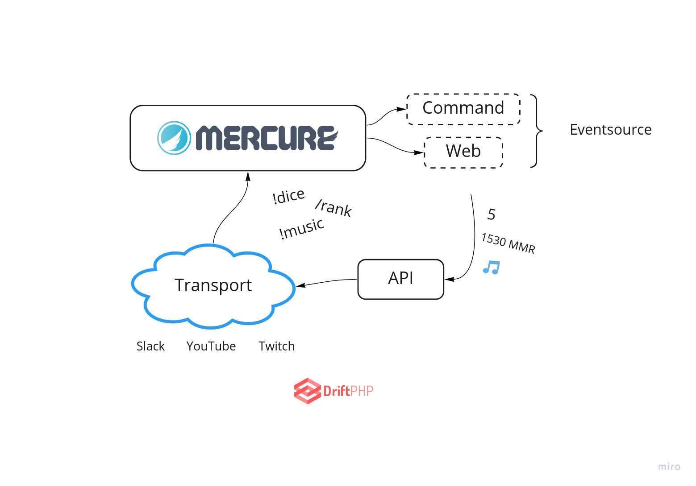

# Bizmuth Bot

Bizmuth Bot is an HTTP-based framework to run usual chatbots using the transport of your choice (twitch, youtube, slack).

It's architecture uses Mercure as a central part of the application. This would probably also work using RabbitMQ although this served as an experiment around the Symfony [EventSourceHttpClient](). 



The asynchronous framework [DriftPHP](https://driftphp.io/) is used to handle asynchronous connections to chat providers (eg: twitch irc) and and access to these providers through an HTTP API. 

## Run

Commands run through supervisord, with docker you have supervisord and mercure pre-configured:

```
docker-compose up --build
```

For production we use [mercure.rocks](https://mercure.rocks) managed hub.

## Profiling

We have ways to profile the running code that uses the [EventSourceHttpClient](). A software will monitor every commands running through supervisord and report statistics via [pidstat](http://sebastien.godard.pagesperso-orange.fr/man_pidstat.html). 

TODO: Env var to enable

Vegeta is then used to stress-test Mercure, for example:

```
cat supervisordstat/vegeta | vegeta attack -format=http -rate 1 -connections 1 | vegeta encode
```

TODO: charts
